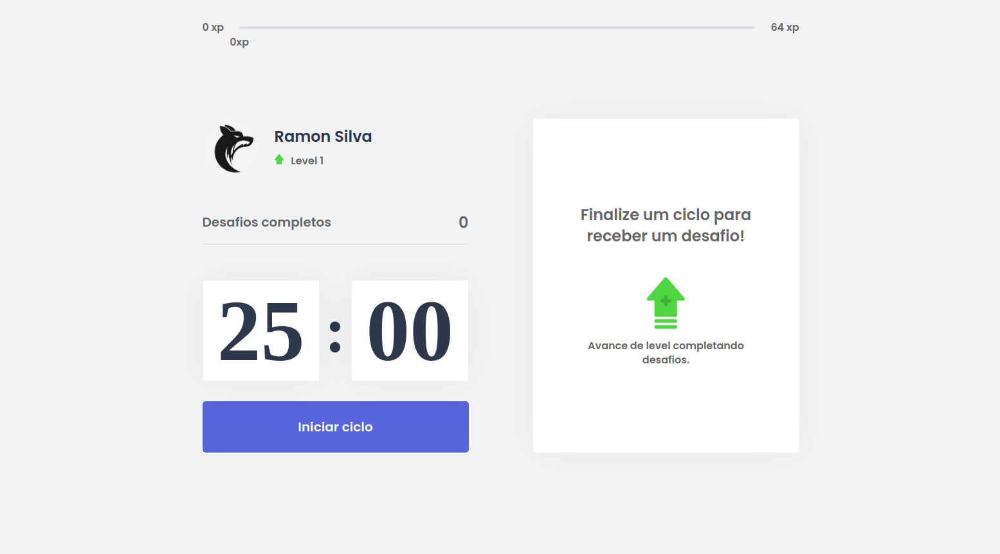

<p align="center">
    
    <br><br>
    
</p>

<p align="center">
  <a href="#-projeto">Projeto</a>&nbsp;&nbsp;&nbsp;|&nbsp;&nbsp;&nbsp;
  <a href="#-ferramentas">Ferramentas</a>&nbsp;&nbsp;&nbsp;|&nbsp;&nbsp;&nbsp;
  <a href="#-layout">Rodando a Aplicação</a>&nbsp;&nbsp;&nbsp;
</p>

<br/>

<p align="center">
    
</p>

<br/>

## 💻 PROJETO

O Move.it é um app que une a técnica de Pomodoro com a realização de exercícios físicos para quem passa muito tempo na frente do computador. A cada 25 minutos (ou seja, um ciclo), um sinal sonoro toca e com ele vem um desafio para a pessoa realizar.

<br/><br/>

## TECNOLOGIAS

Esse projeto foi desenvolvido com as seguintes tecnologias:

- Html
- Css
- Javascript
- [Svelte](https://svelte.dev/)

<br/><br/>

## RODANDO A APLICAÇÃO

```bash

# Clone este repositório
$ git clone https://github.com/RamonSilva20/moveit.git

# Acesse a pasta do projeto
$ cd moveit

# Instale as dependências
$ npm install

# Execute a aplicação 
$ npm run dev

```


---

Projeto inspirado na quarta edição da NLW - Next Level Week da [@Rocketseat](https://rocketseat.com.br)
